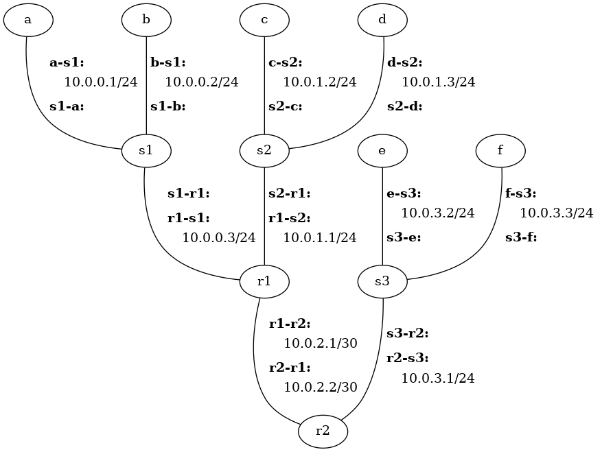

# Hands-On with the Network Layer

The objectives of this assignment are to 1) gain further experience with the
Cougarnet framework developed, and 2) gain hands-on experience with IP subnets
and IP forwarding.


# Getting Started

 
## Update Cougarnet

Make sure you have the most up-to-date version of Cougarnet installed by
running the following in your `cougarnet` directory:

```
$ git pull
$ python3 setup.py build
$ sudo python3 setup.py install
```

Remember that you can always get the most up-to-date documentation for
Cougarnet [here](https://github.com/cdeccio/cougarnet/blob/main/README.md).


## Start the Network

File `h6-r2.cfg` contains a configuration file that describes a network with
six hosts: `a` and `b` connected to router `r1` through switch `s1`; `c` and
`d` connected to a different interface of router `r1` through switch `s2`; `e`
and `f` connected to `r2` through switch `s3`; and routers `r1` and `r2`
directly connected.  There are no VLANs in this scenario.

Run the following command to create and start the network:

```bash
cougarnet --display-file=net.png -w s1 h6-r2.cfg
```

The `--display` option tells `cougarnet` to print out the network layout before
starting all the hosts.  Additionally, `--display-file=net.png` creates an
image, `net.png`, showing the layout with more network details, including IP
addresses and interface names.  This image is included here for convenience:



The `-w` option tells `cougarnet` to start a
`wireshark` instance on `s1`--which means that you can sniff packets from any
of its interfaces (and, because of how it is currently implemented, from any
other switch).  Because of the current configuration, you will only see five
terminals show up, one associated with each of hosts `a`, `c`, and `e`, and one
associated with each of routers `r1` and `r2`.


## Begin Packet Capture
Now go to the open Wireshark window, click the "Capture Options" button (the
gear icon).  Select all interfaces starting with `s1-` and `s2-`, i.e., two of
the switches in the scenario. You can select multiple by holding `ctrl` or
`shift` when you click on the interfaces.


# Exercise

 1. Run the following commands on host `a` to show its network interface
    configuration, forwarding table, and ARP table:

    ```bash
    a$ ip addr 2> /dev/null
    a$ ip route
    a$ ip neigh
    ```

    (The `2> /dev/null` simply redirects standard error, which is noisy due to
    unknown causes related to working in a private network namespace :))

    You should only see one entry in the forwarding table:
    ```
    10.0.0.0/24 dev a-s1 proto kernel scope link src 10.0.0.1 
    ```

    This entry means that for IP destinations matching `10.0.0.0/24`,
    the host will send packets out interface (`dev`) `a-s1`, and that there is
    no explicit next hop--that is, the next hop is whatever the IP
    destination is.  This table entry is created automatically by the system
    when interface `a-s1` is enabled with IP address `10.0.0.1/24` because it
    now knows that it is connected to the `10.0.0.0/24` subnet and thus can
    reach all hosts in `10.0.0.1/24` without going to a router first (i.e., the
    "next hop").

    a. What do you suspect will happen when you send a packet from `a` to `b`
       (10.0.0.2)?

    b. What do you suspect will happen when you send a packet from `a` to `c`
       (10.0.1.2)?

    c. What entries are in `a`'s ARP table?


 2. Now run the following command on `a` to send a single packet from `a` to
    `b`:

    ```bash
    a$ ping -c 1 -W 1 10.0.0.2
    ```

    Look at the Wireshark window, and sort by "Time".
   
    a. What was the nature of the first frame seen from `a`, and which
       of all the hosts/routers (i.e., whether connected to `s1`, `s2`, or
       `s3`) observed that frame (as evidenced by frames observed on switch
       interfaces?  Why?  Note that we haven't hard-coded predictable MAC
       addresses in this configuration, so you will have to get `a`'s MAC
       address from the `ip addr` output.

    b. The response comes from `b`.  Which hosts/routers observed this response
       frame?  Why?

    c. Was the ping successful?


 3. Re-run the `ip neigh` command to see the new state of `a`'s ARP table:

    ```bash
    a$ ip neigh
    ```

    What entries are in the table now?


 4. Now run the following command on `a` to send a single packet from `a` to
    `c`:
   
    ```bash
    a$ ping -c 1 -W 1 10.0.1.2
    ```

    (The `-c` option tells `ping` to send just one packet, and the `-W` option
    tells `ping` to only wait for one second for a response.)

    a. Is it successful?

    b. On what interfaces of `s1` and `s2` is the corresponding packet/frame
       seen?

 5. Let's now add an entry to `a`'s forwarding table.  The general formula is
    this:

    ```
    $ sudo ip route add <prefix> via <next_hop> dev <int>
    ```
    
    where `<prefix>` is an IP prefix (e.g., `192.0.2.0/24`), `<int>` is the
    name of the interface on which outgoing packets should be sent for that
    prefix, and `<next_hop>` is the IP address of the router on that link.

    In this case, you want a "default" route, which means it should match
    *anything*.  Remember, due to longest prefix matching and the fact that
    there is already an entry in the table for `10.0.0.0/24`, it will only
    match this default entry when a datagram is destined for an IP address
    outside `a`'s subnet (`10.0.0.0/24`).

    Show the command for adding the default route, then add that entry to `a`'s
    forwarding table, using the command and description above.

 6. Again run the following command on `a` to send a single packet from `a` to
    `c`:
   
    ```bash
    a$ ping -c 1 -W 1 10.0.1.2
    ```

    a. Looking at the first frame *leaving* `r1` as observed by `s2`, what was
       its nature, and which of all the hosts/routers (i.e., whether connected
       to `s1`, `s2`, or `s3`) observed that frame (as evidenced by frames
       observed on switch interfaces?  Why?  Note that we haven't hard-coded
       predictable MAC addresses in this configuration, so you will have to get
       `r1`'s MAC address from the `ip addr` output.

    b. Is it seen on any interfaces of `s1`?  Why or why not?

    c. Was the ping successful?

 7. Re-run the `ip neigh` command on `r1` to see the state of its ARP table:

    ```bash
    r1$ ip neigh
    ```

    What entries are in the table now?


 8. Follow the instructions from problem 5 to add the appropriate default route
    to host `c`, so it can send response messages to hosts outside its subnet.
    Show the command you used.


 9. Again run the following command on `a` to send a single packet from `a` to
    `c`:
   
    ```bash
    a$ ping -c 1 -W 1 10.0.1.2
    ```

    Was it successful?  Hint: it should be.

 10. Take a look at the forwarding table entries for `r1` and `r2`.  Note that
     they too only have entries for the subnets on which they have interfaces.
     For `r1`, add entries for the specific subnets to which `r2` is directly
     connected, and vice-versa.  Determine the appropriate interface names and
     next hop IP addresses.  Then add a forwarding entry for the default route
     to host `e`.

     a. Show the commands you used to add the appropriate entries to `r1`,
        `r2`, and `e`.

     b. Show the outcome of running the following on `a` and `c`, respectively:

        ```bash
        a$ ping -c 1 -W 1 10.0.3.2
        ```

        ```bash
        c$ ping -c 1 -W 1 10.0.3.2
        ```

        Hint: the should both work.
