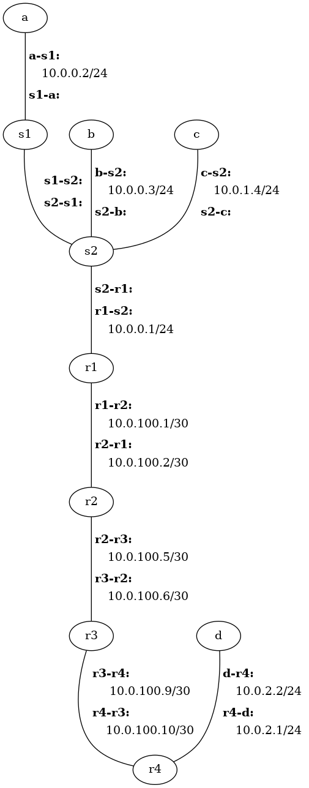

# Full-Stack Network Lab

This lab is the culmination of the labs you have accomplished up to this point.  
With only few exceptions, you have implemented different components of the
network stack independent of the others.  In this lab you will glue those
components together to build a fully-functioning end-to-end communications path
and communicate over that path from socket to socket, process to process.

# Table of Contents

 - [Getting Started](#getting-started)
   - [Update Cougarnet](#update-cougarnet)
   - [Resources Provided](#resources-provided)
   - [Topology](#topology)
 - [Instructions](#instructions)
 - [Submission](#submission)


# Getting Started

## Update Cougarnet

Make sure you have the most up-to-date version of Cougarnet installed by
running the following in your `cougarnet` directory:

```bash
$ git pull
$ python3 setup.py build
$ sudo python3 setup.py install
```

Remember that you can always get the most up-to-date documentation for
Cougarnet [here](https://github.com/cdeccio/cougarnet/blob/main/README.md).


## Resources Provided

## Topology

All scenario files contain the same network topology.  Hosts `a`, `b`, and `c`,
and one interface of router `r1` are all connected via two switches, `s1` and
`s2`.  Hosts `a` and `b` and the `r1` interface are one VLAN, while `c` is on
another VLAN.  Therefore, you should expect no link-layer activity between `a`
and `c`, for example.  Routers `r1`, `r2`, `r3`, and `r4` are directly
connected to one another, in that order.  Finally host `d` is connected to
router `r4`, in another LAN.



While the topolgy remains the same for all scenarios, there are some changes
across the different scenarios, including which hosts (if any) are running in
"native mode" (if any), what explicit routes are provided for manual entry into
forwarding tables, and what scripts are run (if any).


# Instructions


## Handle Subnet-Level Broadcasts

 - Integrate your implementations of the `Host` methods into `host.py`, using
   the `host.py` you created in the
   [Network-Layer Lab](https://github.com/cdeccio/byu-cs460-f2021/tree/master/lab-network-layer)).

   It is important that you integrate your code in the newer file, rather than
   simply overwriting the existing file; the existing file has been updated for
   use with this lab.
 - `Host.handle_ip()` currently accepts IP packets with destination address
   matching either an IP address associated with an interface on the host
   or the global broadcast IP address, 255.255.255.255.

   Modify `Host.handle_ip()` to also accept packets destined for the local
   broadcast address for each of the host's interfaces.  This can be found
   with the `int_to_info` attribute, which is documented
   [here](https://github.com/cdeccio/cougarnet/blob/main/README.md#baseframehandler).
 - `Host.send_packet_on_int()` currently checks the host's ARP table for an
   entry corresponding to the next-hop IP address, and if no entry is found, it
   sends an ARP request.  However, in the case that the destination IP address
   is the local broadcast address, the packet itself should go to every host on
   the LAN.  And of course, no host has an interface configured with a
   broadcast IP address (i.e., because it is special address designed for the
   very purpose of designating that a packet to to every host), so an ARP
   request would go unanswered.

   Modify `Host.send_packet_on_int()` to check if the destination IP address of
   the packet being sent matches the broadcast IP address for the subnet
   corresponding to the interface on which it is being sent. This broadcast IP
   address can be found with the `int_to_info` attribute, which is documented
   [here](https://github.com/cdeccio/cougarnet/blob/main/README.md#baseframehandler).
   If the destination IP address matches the subnet's broadcast IP address,
   then simply use the broadcast MAC address (ff:ff:ff:ff:ff:ff) as the
   destination MAC address.

To test your functionality, you can run the following:

```
$ cougarnet scenario1.cfg
```

At five seconds, a single ICMP packet is sent from host `a` to the broadcast IP
address for the subnet, i.e., 10.0.0.255.  You should see output that it is
received by all other hosts on the subnet/VLAN, and you should _not_ see output
that it has been treated as a packet to be ignored or forwarded (i.e., "not my
packet").


## Integrate Forwarding Table

 - Integrate your implementations of the `ForwardingTable` methods into
   `forwarding_table.py`, using the `forwarding_table.py` you created in the
   [Network-Layer Lab](https://github.com/cdeccio/byu-cs460-f2021/tree/master/lab-network-layer).
 - Integrate your implementations of the `IPAddress` and `Subnet` methods into
   `subnet.py`, using the `subnet.py` you created in the
   [Network-Layer Lab](https://github.com/cdeccio/byu-cs460-f2021/tree/master/lab-network-layer).

In both cases, it is important that you integrate your code in the newer file,
rather than simply overwriting the existing file; the existing file has been
updated for use with this lab.


To test your functionality, you can run the following:

```bash
$ cougarnet scenario2.cfg
```

With this configuration, routers `r1` through `r4` run your implementation for
forwarding table lookups and forwarding, but they get their entries from the
configuration files, not from routing.  Hosts `a` through `d` are running in
"native apps" mode, so you can run commands like `ping`.  With the scenario
running, run the following from host `a` to test end-to-end connectivity:


```bash
a$ ping b
a$ ping d
```

The commands should execute successfully.


## Integrate UDP Socket Functionality

 - Integrate your implementations of the `IPv4Header`, `UDPHeader`, and
   `TCPHeader`. into `headers.py`, using the `headers.py` you created in the
   [Transport-Layer Lab](https://github.com/cdeccio/byu-cs460-f2021/tree/master/lab-transport-layer).
 - Integrate your implementation of the `UDPSocket` into `mysocket.py`, using
   the `mysocket.py` you created in the
   [Transport-Layer Lab](https://github.com/cdeccio/byu-cs460-f2021/tree/master/lab-transport-layer).


## Route Prefixes Instead of IP Addresses

 - Integrate your distance vector (DV) routing implementation from the
   `DVRouter` class into `dvrouter.py`, using the `dvrouter.py` you created in
   the 
   [Routing Lab](https://github.com/cdeccio/byu-cs460-f2021/tree/master/lab-routing).

   It is important that you integrate your code in the newer file, rather than
   simply overwriting the existing file; the existing file has been updated for
   use with this lab.
 - In the
   [Routing Lab](https://github.com/cdeccio/byu-cs460-f2021/tree/master/lab-routing).
   each router announced its IP addresses (i.e., in the DV), such that each
   learned the shortest distance (and next hop) associated for a set of IP
   addresses--or /32 networks.  This was to simplify implementation and to
   avoid dependency on ARP.  However, in a more realistic scenario, prefixes
   (i.e., with more than one IP address) are announced instead.

   Modify your `DVRouter` implementation such that the DVs map IP prefixes to
   distances instead of mapping IP addresses to distances.  This really
   only requires a change in one place in your code.  When your router iterates
   over its interfaces to populate its DV with its own IP addresses, substitute 
   the IP address with the IP prefix for that subnet, in x.x.x.x/y format.

   For example, with the [current topology](#topology) `r1`'s initial DV (i.e.,
   before it receives any DVs from neighbors) will look something like this:

   - Prefix: 10.0.0.0/24; Distance: 0
   - Prefix: 10.0.100.0/30; Distance: 0

   And `r2`'s initial DV will look something like this:
   
   - Prefix: 10.0.100.0/30; Distance: 0
   - Prefix: 10.0.100.4/30; Distance: 0

   It might seem confusing that prefix 10.0.100.0/30 originates from two
   different routers, specifically `r1` and `r2`.  To help explain this
   apparent discrepancy, remember that the goal of routing is not to get a
   packet to the destination host but to get the packet to the router that has
   in interface in the same LAN as the destination.  So whether a packet
   destined for 10.0.100.1 arrives at `r1` or `r2`, it doesn't matter.  Both
   routers have an interface in 10.0.100.0/30 and thus can use ARP and Ethernet
   to get the packet to its final destination.
   
   The next question is how to create the prefix from the IP address.
   This is really just the first "address" in the prefix.  That means that it
   is just a matter of applying the `IPAddress.mask()` method that you created
   for the 
   [Network-Layer Lab](https://github.com/cdeccio/byu-cs460-f2021/tree/master/lab-network-layer).
   This preserves only the left-most `prefix_len` bits of the IP address (i.e.,
   the "network" portion of the address), where `prefix_len` is the length of
   the IP prefix associated with the IP address; the balance of the bits (i.e.,
   the "host" portion of the address) are unset.
   
   To help you with prefix generation, you can use the `IPAddress.to_subnet()`
   method, which has been implemented for you (but uses the `IPAddress.mask()`
   method you implemented).  Given an IP address, `ipaddr` (type `str`) and a
   prefix length, `prefix_len` (type `int`), a pure prefix can be generated
   like this:

   ```python
   ipaddr = IPAddress(ipaddr)
   subnet = str(ipaddr.to_subnet(prefix_len))
   ```

   Thus with `ipaddr = '192.0.2.2'` and `prefix_len = 24`, the value of
   `subnet` would be `'192.0.2.0/24'`.
   
   The IP address and prefix length for each interface can be found with the
   `int_to_info` attribute.


# Submission

