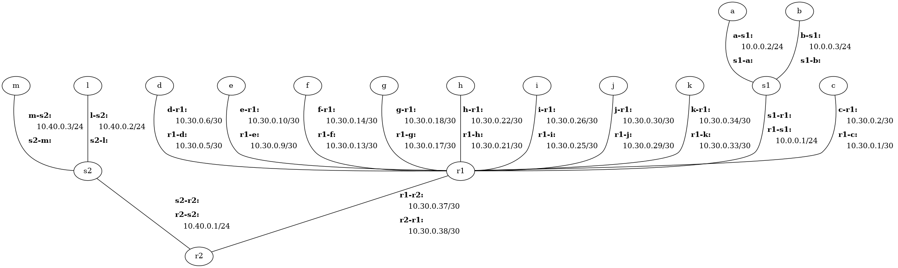

# Network-Layer Lab

The objective of this assignment is to give you hands-on experience with the
network layer and how it interacts with the link layer.  To accomplish this,
you will implement the Address Resolution Protocol (ARP), forwarding tables,
and a router!


# Getting Started

## Update Cougarnet

Make sure you have the most up-to-date version of Cougarnet installed by
running the following in your `cougarnet` directory:

```
$ git pull
$ python3 setup.py build
$ sudo python3 setup.py install
```

Remember that you can always get the most up-to-date documentation for
Cougarnet [here](https://github.com/cdeccio/cougarnet/blob/main/README.md).


## Resources Provided

The files given to you for this lab are the following:
 - `host.py` - a file containing a stub implementation of a host (and router).
   This is where you will do your work!
 - `subnet.py` - a file containing a stub code for IP address comparison and
   testing whether an IP address is a member of a subnet.  You will also do
   your work here!
 - `forwarding_table.py` - a file containing a stub implementation of an IP
   forwarding table.  You will also do your work here!
 - `scenario1.cfg` and `scenario2.cfg` -
   [network configuration files](https://github.com/cdeccio/cougarnet/blob/main/README.md#network-configuration-file)
   describing three topologies for testing different aspects of functionality
   related to this lab.
 - `scenario1.py` and `scenario2.py` -
   scripts that run various tests in conjunction with the network configuration
   files.


# Part 1 - Address Resolution Protocol (ARP)

In this part of the lab, you will develop a working ARP implementation for your
hosts and routers.

## Scenario Description

The file `scenario1.cfg` describes a network with three hosts and one router:
`a`, `b`, and `r1` connected to switch `s1`, and `c` and `r1` connected to
switch `s2`.  The topology looks like this:

```
         +----+
          | a  |
          +----+
            |
            |
            |
+---+     +----+
| b | --- | s1 |
+---+     +----+
            |
            |
            |
          +----+
          | r1 | -+
          +----+  |
          +----+  |
          | c  |  |
          +----+  |
            |     |
            |     |
            |     |
          +----+  |
          | s2 | -+
          +----+
```

The switch is a working switch; you do not have to implement its functionality!
Your focus is on the host/router functionality.


## Starter Commands

Take a look at the contents of `scenario1.cfg`.  Then run the following to
start it up:

Run the following command:

```
$ cougarnet --disable-ipv6 --display scenario1.cfg
```

After a few seconds of awkward silence, you will see output on the terminal
corresponding to Host `a`.  The output is made by placeholder code in
`host.py`.  Instead of sending packets, it simply prints out that that's what
it would do.  What is missing at this point is:

 - a mechanism to map the IP address of the next hop to a MAC address - ARP!;
 - an Ethernet frame header to encapsulate the IP packet;
 - some logic to determine which frames should be acted upon

When these things are added, you will be able to send IP packets across a local
area network (LAN), as long as you know the outgoing interface and the next-hop
IP address.  We will learn how to determine outgoing interface and next-hop in
the [Part 3](#part-3---ip-forwarding).


## Frames Issued

With `scenario1.cfg`, the `send_packet_on_int()` is called for the following
packets at the following times (note that times are approximate).  Each
sub-bullet describes the purpose of the primary bullet under which it is
listed.

 - 4 seconds: packet sent from `a` to `b`
   - There is initially no ARP entry for `b`'s IP address in `a`'s table.
   - `a`'s ARP request should be seen by all hosts on the same LAN.
   - After the ARP response is received by `a`, the ICMP packet from `a` should
     be seen by (only) `b`.
 - 6 seconds: packet sent from `a` to `b`
   - There is already an ARP entry for `b`'s IP address in `a`'s table.
   - The ICMP packet from `a` should be seen by (only) `b`.
 - 8 seconds: packet sent from `b` to `a`
   - There is already an ARP entry for `a`'s IP address in `b`'s table (from
     the previous ARP request).
   - The ICMP packet from `b` should be seen by (only) `a`.
 - 10 seconds: packet sent from `a` to `c` (next hop: `r1`)
   - There is initially no ARP entry for `r1`'s IP address in `a`'s table.
   - `a`'s ARP request should be seen by all hosts on the same LAN.
   - After the ARP response is received by `a`, the ICMP packet from `a` should
     be seen by (only) `b`.
   - The ICMP packet from `a` should be seen by (only) `r1`. Once IP forwarding
     is working (Part 3), then `c` will also see the packet.


## Instructions

In the file `host.py`, flesh out following the skeleton methods related to ARP:

 - `send_packet_on_int()`.  This method takes the following as arguments:

   - `pkt`: an IP packet, complete with IP header.  Generally, this could be
     either an IPv4 or an IPv6 packet, but for the purposes of this lab, it
     will just be IPv4.
   - `intf`: the name of an interface on the host, on which the packet will be
     sent.
   - `next_hop`: the IP address of the next hop for to the packet, which is
     either the IP destination, if on the same subnet as the host, or the IP
     address of a router.

   The method should do the following:

   - Find the MAC address corresponding to `next_hop`, the next-hop IP address.
     To do this, it should check the host-wide ARP table to see if a mapping
     already exists.

     If a mapping exists, then it can simply build an Ethernet frame consisting
     of:

     - Destination MAC address: the MAC address corresponding to the next-hop
       IP address.
     - Source MAC address: the MAC address corresponding to the outgoing
       interface.  This can be found with the `int_to_info` attribute, which is
       documented
       [here](https://github.com/cdeccio/cougarnet/blob/main/README.md#baseframehandler).
     - Type IP (`ETH_P_IP = 0x0800`)
     - The IP packet as the Ethernet payload.

     Then it can send that frame by calling the `send_frame()` method (which is
     defined in the parent class).

     If no mapping exists, then it does the following:

     - queue the packet, along with interface and next hop, for later sending
     - create an [ARP request](#arp-packets), such that:
       - The sender IP address is the IP address associated with the outgoing
	 interface.  This can be found with the `int_to_info`
         [attribute](https://github.com/cdeccio/cougarnet/blob/main/README.md#baseframehandler)
         of the host.
       - The sender MAC address is the MAC address corresponding to the outgoing
         interface.
       - The target IP address is the next-hop IP address.
       - The target MAC address is all zeroes (this field is ignored by the receiver).
       - The MAC address of the incoming interface is used as the sender MAC
         address.
       - The opcode is request (`ARPOP_REQUEST = 1`).

     - build and send an Ethernet frame containing the ARP request, consisting
       of:
       - Destination MAC address: the Ethernet broadcast address:
         (`ff:ff:ff:ff:ff:ff`)
       - Source MAC address: the MAC address corresponding to the outgoing
         interface.
       - Type ARP (`ETH_P_ARP =  0x0806`)
       - The ARP request as the Ethernet payload.

     The IP packet will get sent later, when the ARP response is received.

 - `handle_arp()`.  This method takes the following as arguments:

   - `pkt` - the ARP packet received
   - `intf` - the interface on which it was received

   This method is called when an Ethernet frame is received by a node, and the
   type field of the Ethernet frame header indicates that the Ethernet payload
   is an ARP packet (i.e., its `type` is `ETH_P_ARP`).

   The method should do the following:

   - Determine whether the ARP packet is an ARP request or an ARP response
     (i.e., using the opcode field), then call `handle_arp_response()` or
     `handle_arp_request()` accordingly.

 - `handle_arp_request()`.  This method takes the same arguments as
   `handle_arp()`:

   The method should do the following:

   - Parse out the IP address and MAC address of the sender.
   - Update its own ARP table with an entry that maps the IP address of the
     sender to the MAC address of the sender.
   - If the target IP address matches an IPv4 address on the incoming
     interface, `intf`, then create an ARP response such that:
     - The sender and target IP addresses are reversed.
     - The sender MAC address is used as the target MAC address.
     - The MAC address of the incoming interface is used as the sender MAC
       address.
     - The opcode is reply (`ARPOP_REPLY = 2`).
   - build and send an Ethernet frame containing the ARP response, consisting
     of:
     - Destination MAC address: the MAC address of the entity that sent the
       request sender (i.e., matching the target address in the ARP response).
     - Source MAC address: the MAC address corresponding to the interface on
       which the request was received (and which will also the outgoing
       interface).
     - Type ARP (`ETH_P_ARP = 0x0806`)
     - The ARP response packet as the Ethernet payload.

 - `handle_arp_response()`.  This method takes the same arguments as
   `handle_arp()`:

   The method should do the following:

   - Parse out the IP address and MAC address of the sender.
   - Update its ARP table with an entry that maps the IP address of the
     sender to the MAC address of the sender.
   - Go through its queue of packets that were waiting for this ARP response,
     i.e., those whose next hop corresponds to the sender IP address in the
     response. Send all the packets.

 - `_handle_frame()`.  This method takes the following as arguments:

   - `frame` - the Ethernet frame received
   - `intf` - the interface on which it was received

   The method should do the following:

   - Parse out the destination MAC address in the frame.
   - If the destination MAC address either matches the MAC address
     corresponding to the interface on which it was received or is the
     broadcast MAC address (`ff:ff:ff:ff:ff:ff`), then call another method to
     handle the payload, depending on its type:
     - For type `ETH_P_IP`, extract the payload and call `handle_ip()`, passing
       the Ethernet payload and the interface on which it arrived.
     - For type `ETH_P_ARP`, extract the payload and call `handle_arp()`,
       passing the Ethernet payload and the interface on which it arrived.
     - For all other types, take no further action.
   - If the destination address does not match or is not the Ethernet
     broadcast, then call `not_my_frame()`, passing it the full frame and the
     interface on which it arrived.

 - `not_my_frame()`.  There is no need to flesh out this method.  It is simply
   a placeholder for debugging.


## Testing

Test your implementation against scenario 1.  Determine the appropriate
output--that is, which hosts should receive which frames--and make sure that
the cougarnet output matches appropriately.

When it is working properly, test also with the `--terminal=none` option:

```
$ cougarnet --disable-ipv6 --terminal=none scenario1.cfg
```


## Helps

### Ethernet Frames

See the documentation for the Link-Layer lab for
[additional helps for Ethernet frames](https://github.com/cdeccio/byu-cs460-f2021/blob/master/lab-link-layer/README.md#ethernet-frames).

Note that there are libraries for parsing Ethernet frames and higher-level
packets, but you may not use them for the lab.


### ARP Packets

Your code will need to both create ARP packets for sending and parse ARP
packets that have been received on the "wire".  ARP packets have the following
format:

| Offset | Byte 0 | Byte 1 |
| :---: | :---: | :---: |
| 0 <td colspan=2> Hardware Type
| 2 <td colspan=2> Protocol Type
| 4 | Hardware Address Length | Protocol Address Length |
| 6 <td colspan=2>operation
| 8 <td colspan=2>Sender hardware address (bytes 0 - 1)
| 10 <td colspan=2>Sender hardware address (cont'd) (bytes 2 - 3)
| 12 <td colspan=2>Sender hardware address (cont'd) (bytes 4 - 5)
| 14 <td colspan=2>Sender protocol address (bytes 0 - 1)
| 16 <td colspan=2>Sender protocol address (cont'd) (bytes 2 - 3)
| 18 <td colspan=2>Target hardware address (bytes 0 - 1)
| 20 <td colspan=2>Target hardware address (cont'd) (bytes 2 - 3)
| 22 <td colspan=2>Target hardware address (cont'd) (bytes 4 - 5)
| 24 <td colspan=2>Target protocol address (bytes 0 - 1)
| 26 <td colspan=2>Target protocol address (cont'd) (bytes 2 - 3)

(if this table doesn't render well, check out the
[wikipedia page for ARP](https://en.wikipedia.org/wiki/Address_Resolution_Protocol).)

Regarding the fields:
 - Hardware Type will always be Ethernet (`ARPHRD_ETHER = 1`)
 - Protocol Type will always be IPv4 (`ETH_P_IP = 0x0800`)
 - Hardware Address Length will always be 6 (MAC addresses are six bytes
   long)
 - Protocol Address Length will always be 4 (IPv4 addresses are four bytes
   long)
 - Operation (or opcode) will either be request (`ARPOP_REQUEST = 1`) or reply (`ARPOP_REPLY = 2`).
 - While "Hardware" and "Protocol" are the more generic terms for the fields,
   they are referred to in the instructions as "MAC" and "IP" since those are
   the protocols we are working with.

### Address Representation Conversion

To help you with converting MAC addresses and IP addresses from presentation
(i.e., human readable) format to binary (i.e., machine/network readable)
format and vice-versa, I have created four functions for you, which are already
imported in your `host.py`:

 - `mac_binary_to_str()` - takes a `bytes` instance of a MAC address and
   returns a `str` instance with the MAC address in human-readable format.
 - `mac_str_to_binary()` - takes a `str` instance of a MAC address in
   human-readable format and returns a `bytes` instance of the MAC address.
 - `ip_binary_to_str()` - takes a `bytes` instance of an IP address and
   returns a `str` instance with the IP address in human-readable format.
 - `ip_str_to_binary()` - takes a `str` instance of an IP address in
   human-readable format and returns a `bytes` instance of the IP address.

# Part 2 - Forwarding Table

In this part of the lab, you will create a working forwarding table for use in
your hosts and routers.


## Getting Started

Take a look at both `subnet.py` and `forwarding_table.py`.  Both have starter
code that needs to be fleshed out.  But that starter code comes after a lot of
other stuff at the beginning of the file.  This other stuff is doctests.
[doctests](https://docs.python.org/3/library/doctest.html), are "pieces
of text that look like interactive python sessions" (i.e., starting with
`>>>`), found in the [docstring](https://www.python.org/dev/peps/pep-0257/) of
a Python file, class, function, or method.  Examine the doctests in both files,
and the functions or methods to which they correspond.  Then complete the
following exercises to build a working forwarding table.  Read all exercises
before you begin, as it might be easier for you to do one before the other.


## Instructions

 1. Fill out the following methods (marked with `FIXME`):

    - `IPAddress.mask()` (approx. 1 - 2 lines of code)
    - `Subnet.__contains__()` (approx. 1 line of code)

    These methods are short but require a bit of thought.

 2. Fill in the appropriate return value for each of the doctests for
    `Subnet.__contains__()` in `subnet.py`.  `None` is currently used as a
    placeholder for each output, but the return value _should_ be a boolean
    (`True` or `False`).  You might also choose to create a doctest for
    `IPAddress.mask()`, to check your work, but it is not required.

    When you have finished your revisions of `subnet.py`:

    - The return values in the doc tests must be correct; and
    - The following should run without error (and without output):
    ```
    python3 -m doctest subnet.py
    ```

 3. Fill out the following method (marked with `FIXME`):

    - `ForwardingTable.get_forwarding_entry()` (approx. 10 lines of code)

      Remember to use longest prefix match for the last method!

 4. Fill in the appropriate return value for each of the doctests for
    `ForwardingTable.get_forwarding_entry()` in `forwarding_table.py`.
    `(None, None)` is currently used as a placeholder for each output, but the
    return value _should_ be a tuple of type (`str`, `str`), corresponding to
    outgoing interface name and next hop.

    Note that in the doctest, the next-hop IP address in every entry is
    currently `None`, so the second value in the tuple returned will also
    always be `None`.  This is just for testing.  When we apply this to a real
    host or router, we will give real values for the next-hop IP address.

    When you have finished your revisions of `forwarding_table.py`:

    - The return values in the doc tests must be correct; and
    - The following should run without error (and without output):
    ```
    python3 -m doctest forwarding_table.py
    ```

# Part 3 - IP Forwarding

In this part of the lab, you will develop a working router implementation to
apply to your hosts and routers.


## Scenario Description

The file `scenario2.cfg` describes a network topology.  Hosts `a` and `b` are
connected to router `r1` via switch `s1`.  Hosts `c` through `k` are directly
connected to router `r1` on different interfaces.  Thus, `a` and `b` are on the
same LAN, together with `r1`'s `r1-s1` interface.  Hosts `c` through `k` are
each on their own LAN, shared only by the `r1` interface to which they are
connected.  Finally, hosts `l` and `m` are connected to router `r2` through
switch `s2`, and routers `r1` and `r2` are directly connected.



Again, the switches are already working; you do not have to implement switch
functionality.  Your focus is on the host/router functionality.


## Starter Commands

Take a look at the contents of `scenario2.cfg`.  Then run the following to
start it up:

```
$ cougarnet --disable-ipv6 scenario2.cfg
```

After a few seconds of awkward silence, you will see output on the terminal
corresponding to Host `a`.  The output is made by placeholder code in
`host.py`.  Instead of sending packets, it simply prints out that that's what
it would do.  What is missing at this point is:

 - logic to determine both
   - the interface out which the packet should be sent and
   - the contents (source and destination MAC address) of the Ethernet frame
     header that should encapsulate it;
 - some logic to determine which packets should be acted upon;
 - code to handle packets for which the receiving host is the final destination;
 - code to handle packets for which the receiving host is not the final
   destination.

These will be addressed by initializing the forwarding table you built in
[Part 2](#part-2---forwarding-table), looking up outgoing interface and next hop
in the forwarding table, and actually forwarding packets.  When these things
are added, you will be able to send IP packets from host to host, across
routers and multiple LANs.


## Frames Issued

With `scenario2.cfg`, `send_packet()` is called for the following packets at
the following times (note that times are approximate).  Refer to the
[network diagram above](#scenario-description-1) to help identify their route.
Each sub-bullet describes the purpose of the primary bullet under which it is
listed.

 - 4 seconds: packet sent from `a` to `b`.
   - `a` uses the IP destination as the next hop

 The next set of packets correspond to the tests in
 `forwarding_table.py` (see [Part 2](#part-2-forwarding-table)), so if your
 doctests work, then these should work.

 - 5 seconds: packet sent from `a` to `10.20.0.25`
 - 6 seconds: packet sent from `a` to `10.20.0.34`
 - 7 seconds: packet sent from `a` to `10.20.1.20`
 - 8 seconds: packet sent from `a` to `10.20.3.1`
 - 9 seconds: packet sent from `a` to `10.20.0.2`
 - 10 seconds: packet sent from `a` to `10.20.0.11`
 - 12 seconds: packet sent from `a` to `10.20.0.150`
 - 13 seconds: packet sent from `a` to `10.20.0.7`
 - 14 seconds: packet sent from `a` to `10.20.0.75`

 Finally:

 - 15 seconds: packet sent from `a` to `l`
   - A packet can be sent across several routers
 - 16 seconds: packet sent from `a` to `l` with TTL=1
   - A router drops packets whose TTL is 0 after decrementing

## Instructions

In the file `host.py`, flesh out following the skeleton methods related to IP
forwarding:

 - `__init__()`

   - Initialize the forwarding table (i.e., the one you created in Part 2)
     using two sources:

     - The entries from the `scenario2.cfg` configuration file, provided in the
       `COUGARNET_ROUTES` environment variable.  See the
       [documentation](https://github.com/cdeccio/cougarnet/blob/main/README.md#routes)
       for more on how to do this.  Each entry provided is a three-tuple
       consisting of prefix, outgoing interface, and next hop.

     - The IP prefixes with which each interface is associated.  The prefix for
       each interface can be found in the `int_to_info`
       [attribute](https://github.com/cdeccio/cougarnet/blob/main/README.md#baseframehandler)
       of the host.  For each interface, the added entry should
       consist of the IP prefix for the interface, the interface itself as the
       outgoing interface, and a next hop of `None`.

 - `send_packet()`.  This method takes the following as an argument:

   - `pkt`: an IP packet, complete with IP header.  Generally, this could be
     either an IPv4 or an IPv6 packet, but for the purposes of this lab, it
     will just be IPv4.

   The method should do the following:

   - Parse the IP datagram (the IP header) to extract the destination IP
     address.

   - Find the matching entry in the host's forwarding table.  This yields a
     two-tuple corresponding to an outgoing interface and next hop.

   - If the next hop returned from the forwarding table lookup is `None`, then
     use the destination IP address as the next hop.  This is the case for
     subnets to which the host is directly connected--i.e., the ones populated
     from the directly connected prefixes above.

   - Call `send_packet_on_int()`, passing as arguments the IP datagram (`pkt`),
     the outgoing interface, and the next hop.

 - `handle_ip()`.  This method takes the following as arguments:

   - `pkt` - the IP packet received
   - `intf` - the interface on which it was received

   This method is called by `_handle_frame()` when an IP frame is received, and
   the type field of the Ethernet frame header indicates that the Ethernet payload
   is an IPv4 packet (i.e., its `type` is `ETH_P_IP`).

   The method should do the following:

   - Parse out the destination IP address in the packet.
   - If the destination IP address matches _any_ of the IP addresses on
     the host (i.e., not limited to the IP address on the incoming interface),
     or if the destination IP address is the broadcast IP address
     (`255.255.255.255`), then call another method to handle the payload,
     depending on the protocol value in the IP header:
     - For type TCP (`IPPROTO_TCP = 6`), extract the payload and call
       `handle_tcp()`, passing the full IP datagram, including header.
     - For type UDP (`IPPROTO_UDP = 17`), extract the payload and call
       `handle_udp()`, passing the full IP datagram, including header.
   - If the destination IP address does not match any IP address on the system,
     and it is not the IP broadcast, then call `not_my_packet()`, passing it
     the full IP datagram and the interface on which it arrived.

 - `forward_packet()`. This method takes the following as an argument:

   - `pkt` - the IP packet received

   The method should do the following:

   - Parse the IP datagram (the IP header) to extract the time-to-live (TTL)
     value.  This value represents the number of remaining "hops" (i.e.,
     routers) though which the packet can pass.
   - Decrement the TTL value by 1.  If the resulting value is 0, then simply
     return.  Expired packets should not be forwarded.
   - Replace the TTL in the IP datagram with the decremented value.
   - Call `send_packet()` on the modified packet.

 - `not_my_packet()`. This method takes the following as arguments:

   - `pkt` - the IP packet received
   - `intf` - the interface on which it was received

   The method should do the following:

   - If the value of the `_ip_forward` instance member is `False`, then there
     is no need to go any further!  Simply return.  Otherwise (`True`),
     call `forward_packet()`.

 - `handle_tcp()`, `handle_udp()`.  There is no need to
   flesh out these methods.  They are simply placeholders for debugging.


## Testing

Test your implementation against scenario 2.  Determine the appropriate
output--that is, which hosts should receive which packets--and make sure that
the cougarnet output matches appropriately.

When it is working properly, test also with the `--terminal=none` option:

```
$ cougarnet --disable-ipv6 --terminal=none scenario2.cfg
```


## Helps

### IPv4 Packets

Your code will need to parse IPv4 packets, both as received from the "wire" and
as passed by a method (e.g., `send_packet()`--in both cases as `bytes`
instances.  The packet that you will be receiving looks like this:


(Taken from the
[wikipedia page for IPv4](https://en.wikipedia.org/wiki/IPv4)


### Address Representation Conversion

See the help on
[Address Representation Conversion](#address-representation-conversion) above.
above.


# Other Helps

 - Print to standard out for debugging purposes.  For a script running in a
   virtual host (i.e., with the `prog` option), all output will go to the
   terminal associated with that host, assuming `terminal=false` is not used in
   the configuration file and `--terminal=none` is not used on the command
   line.  See
   [the documentation](https://github.com/cdeccio/cougarnet/blob/main/README.md#additional-options).
   for more.
 - You can modify `scenario1.py`, `scenario2.py`, and the corresponding
   configuration files all you want for testing and for experimentation.  If
   this helps you, please do it!  Just note that your submission will be graded
   using only your `host.py`, `subnet.py`, and `forwarding_table.py`. The other
   files used will be the stock files [you were provided](#resources-provided).
 - Save your work often, especially after you move from part to part.  Part 2.
   You are welcome (and encouraged) to use a version control repository, such
   as GitHub.  However, please ensure that it is a private repository!


# Submission

Use the following commands to create a directory, place your working files in
it, and tar it up:

```
$ mkdir network-lab
$ cp host.py subnet.py forwarding_table.py network-lab
$ tar -zcvf network-lab.tar.gz network-lab
```
