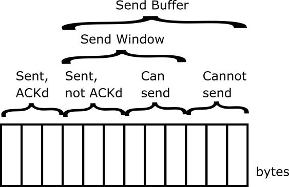
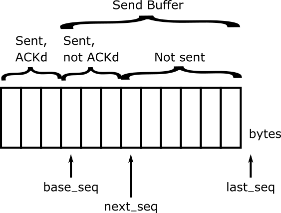
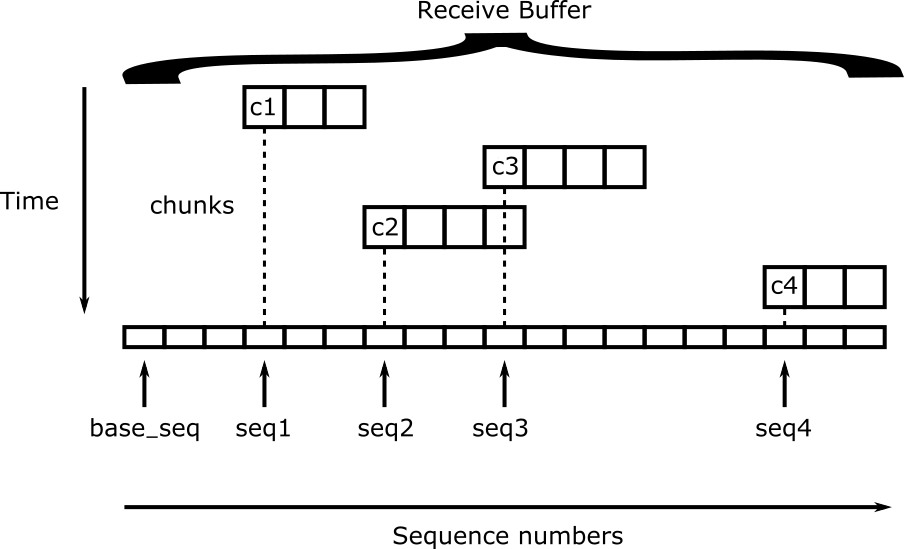
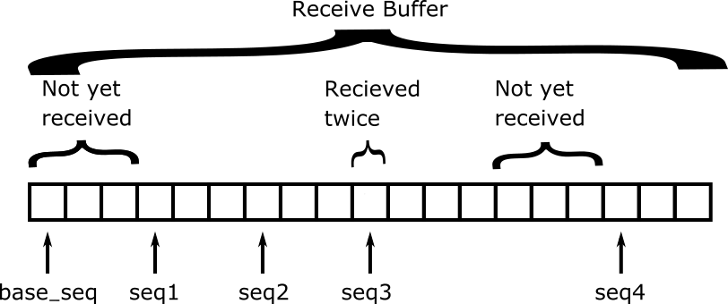
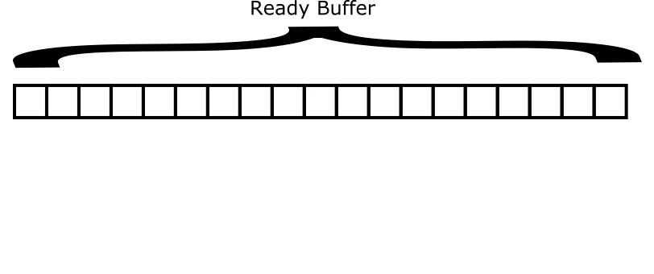

# TCP Lab

The objective of this assignment is to give you hands-on experience with TCP.
You will implement much of TCP, such that bytes are sent reliably in-order
between TCP sockets connected over a TCP connection.

# Table of Contents

 - [Getting Started](#getting-started)
   - [Update Cougarnet](#update-cougarnet)
   - [Resources Provided](#resources-provided)
   - [Helpful Reading](#helpful-reading)
   - [Topology](#topology)
 - [Part 1 - TCP Send Buffer](#part-1---tcp-send-buffer)
   - [Instructions](#instructions)
   - [Testing](#testing)
 - [Part 2 - TCP Receive Buffer](#part-2---tcp-receive-buffer)
   - [Instructions](#instructions-1)
   - [Testing](#testing-1)
 - [Part 3 - Reliable Delivery](#part-3---reliable-delivery)
   - [Instructions](#instructions-2)
   - [Testing](#testing-2)
 - [Part 4 - Fast Retransmit](#part-4---fast-retransmit)
   - [Instructions](#instructions-3)
   - [Testing](#testing-3)
 - [Submission](#submission)


# Getting Started

## Update Cougarnet

Make sure you have the most up-to-date version of Cougarnet installed by
running the following in your `cougarnet` directory:

```bash
$ git pull
$ python3 setup.py build
$ sudo python3 setup.py install
```

Remember that you can always get the most up-to-date documentation for
Cougarnet [here](https://github.com/cdeccio/cougarnet/blob/main/README.md).


## Resources Provided

The files given to you for this lab are the following:
 - `buffer.py` - a file containing a stub implementation of a TCP send and
   receive buffer.  This is where you will do your work.
 - `test_buffer.py` - a file containing unit tests, which will be used to test
   your TCP buffer implementations.
 - `host.py` - a file containing a basic implementation of a host.  Note that
   this is pared down version of the `Host` class you implemented in the
   [Network-Layer Lab](https://github.com/cdeccio/byu-cs460-f2021/tree/master/lab-network-layer)
   in which the `send_packet()` method simply picks an outgoing interface,
   creates a frame with the broadcast address as its destination, and sends the
   frame out the interface.
 - `transporthost.py` - a file containing a stub implementation of a host with
   transport-layer capabilities.  It inherits from `Host` and overrides the
   `handle_udp()` and `handle_tcp()` methods.  You will also do your work here!
 - `transporthost.py` - a file containing a basic implementation of a host that has transport-layer capabilities.  Note that
   this is pared down version of the `TransportHost` class you implemented in the
   [Transport-Layer Lab](https://github.com/cdeccio/byu-cs460-f2021/tree/master/lab-transport-layer)
   in which the `handle_tcp()` simply expects a matching TCP connection to
   exist and calls `handle_packet()` on the corresponding socket, a `TCPSocket`
   instance.
 - `test.txt` and `byu-y-mtn.jpg` - files that are to transferred from one host
   to another to test your reliable transfer functionality.
 - `mysocket.py` - a file containing a stub code for a TCP socket.  You will
   also do your work here!
 - `scenario1.cfg` - a
   [network configuration file](https://github.com/cdeccio/cougarnet/blob/main/README.md#network-configuration-file)
   for testing your implementation.
 - `scenario1.py` - a script that tests the functionality of your reliable
   transport implementation.


## Helpful Reading
Read Section 3.5.4 ("Reliable Data Transfer") in the book.

## Topology

The file `scenario1.cfg` describes a network topology in which hosts `a` and
`b` are connected to each other via a single switch, `s1`.

```
+----+
| a  |
+----+
  |
  |
  |
+----+
| s1 |
+----+
  |
  |
  |
+----+
| b  |
+----+
```

`s1` has switching functionality already built in, and all hosts have the
basic functionality of taking a packet, encapusulating in an Ethernet frame,
and sending it to the appropriate host on its LAN/subnet.  Additionally,
rudimentary transport-layer multiplexing functionality has been implemented for
you.  What you will be adding is a reliable data channel for sending data
between the two hosts, over an established connection.


# Part 1 - TCP Send Buffer

In this part of the lab, you will write the code which is used by the TCP peer
to buffer bytes that are intended to be reliably sent, i.e., when
`TCPSocket.send()` is called by an application.

The following image illustrates the role of the send buffer from the
perspective of the `TCPSocket` class.



The `TCPSocket` class implements the sliding window for reliable delivery, with
the help of a `TCPSendBuffer` instance.  However, the `TCPSendBuffer` class
doesn't know anything about the size of the window (which will change over
time); it simply keeps track of:

 - all bytes that need to be sent; and
 - which of those bytes have been sent, but not acknowledged

Both of these are dictated by the `TCPSocket` instance using methods that will
be shown hereafter.  The perspective of the `TCPSendBuffer` is shown in the
following diagram:



Note that in both images the bytes labeled "Sent, ACK'd" are technically not
part of the buffer because nothing more needs to be done with them!  They are
simply shown for continuity.

You can think of the entire buffer as a stream of bytes.  Thus, there is a
sequence number associated with each byte in the buffer.  The three most
important numbers to keep track of are:

 - `base_seq` - the sequence number of the first unacknowledged byte in the
   window.
 - `next_seq` - the sequence number of the first yet-to-be-sent byte in the
   window.
 - `last_seq` - the sequence number of the byte _after_ the last byte in the
   buffer.

These are what help the buffer identify its current state, including the
locations of the "divisions" that are labeled in the above diagram.  For
example:

 - when `base_seq = next_seq`, then there are no bytes waiting to be
   acknowledged;
 - when `next_seq = last_seq`, there are no bytes in the buffer that haven't
   been sent; and
 - when `base_seq < next_seq < last_seq`, there is at least one byte that has
   been sent but not acknowledged, and at least one byte that has not been sent
   at all.

Note again that there is nothing for the buffer to know where the boundary of
the window is.   Thus, in the last case, the buffer does not actually know
whether or not the bytes(s) could be sent.  _That_ is the job if the
`TCPSocket` class.  Interfacing with the buffer is therefore a largely a matter
of calling methods like `put()`, `get()`, `slide()`, and `get_for_resend()`,
which are explained subsequently.


## Instructions

In the file `buffer.py`, flesh out the following methods for the
`TCPSendBuffer` class.

 - `put()` - This method takes the following as an argument:

   - `data`: raw bytes (`bytes`) to be sent across a TCP connection.

   With this method data is added to the buffer.  This is called by
   `TCPSocket.send()`, such that all bytes are initially buffered and only sent
   if/when there is room in the window.

   For example, suppose the following are the values associated with a
   `TCPSendBuffer` instance:

   ```python
   buffer = b'abcdefg'
   last_seq = 1064
   ```

   When `put(b'hijk')` is called, then those would be changed to the following:

   ```python
   buffer = b'abcdefghijk'
   last_seq = 1068
   ```

 - `get()` - This method takes the following as an argument:

   - `size`: the number of bytes (`int`), at most, to be retrieved from the
     buffer.

   This method retrieves (at most) the next `size` bytes of data that have not
   yet been sent, so they can be sent using `send_packet()`.  It returns a
   tuple of `(bytes, int)`, where the first element is the bytes themselves and
   the second is the starting sequence number.  Typically `size` is max segment
   size (MSS).  If `size` exceeds the amount of data in the buffer, then only
   the remaining bytes are returned.

   This method is typically called in two cases: (1) when data is sent by the
   application to the socket (i.e., with `TCPSocket.send()`), and the window
   size allows for at least some of those bytes to be sent immediately; or (2)
   when an acknowledgment for new data is received, such that the window can be
   slid and more bytes sent.

   For example, suppose the following are the values associated with a
   `TCPSendBuffer` instance:

   ```python
   buffer = b'abcdefghijk'
   base_seq = 1057
   next_seq = 1061
   ```

   When `get(4)` is called, then those would be changed to the following:

   ```python
   buffer = b'abcdefghijk' # unchanged
   base_seq = 1057
   next_seq = 1065
   ```

   And the data returned would be: `(b'efgh', 1061)`


 - `get_for_resend()` - This method takes the following as an argument:

   - `size`: the number of bytes (`int`), at most, to be retrieved from the
     buffer.

   This method retrieves the next `size` bytes of data that have previously
   been sent but not yet acknowledged.  Typically `size` is MSS.  If `size`
   exceeds the amount of data in the buffer, then only the remaining bytes are
   returned.

   This is typically called after a loss event, such as timeout or
   triple-duplcate ACK.

   Note that this method is very much like `get()`, with the major differences
   being 1) the _starting_ place of the bytes to be returned and 2) the fact
   that `next_seq` is not changed after `get_for_resend()` is called.

   For example, suppose the following are the values associated with a
   `TCPSendBuffer` instance:

   ```python
   buffer = b'abcdefghijk'
   base_seq = 1057
   next_seq = 1061
   ```

   When `get_for_resend(4)` is called, the return value would be:
   `(b'abcd', 1057)`, and the values of `buffer`, `base_seq`, and `next_seq`
   would remain unchanged.

 - `slide()` - This method takes the following as an argument:

   - `seq`: the sequence number returned in the acknowledgment field of a TCP
     packet, i.e., acknowledging all bytes previous to that sequence number.

   This method acknowledges bytes from the buffer that have previously been
   sent but not acknowledged, opening the door for more bytes to be sent.  For
   example, suppose the following are the values associated with
   `TCPSendBuffer` instance:

   ```python
   buffer = b'abcdefghijk'
   base_seq = 1057
   ```

   When `slide(1061)` is called, then those would be changed to the following:

   ```python
   buffer = b'efghijk'
   base_seq = 1061
   ```

Also flesh out the following utility methods:

 - `bytes_not_yet_sent()` - return an `int` representing the number of
   bytes not-yet-sent in the buffer.


 - `bytes_outstanding()` - return an `int` representing the number of
   bytes sent but not yet acknowledged.


## Testing

The file `test_buffer.py` contains a suite of tests that use python's
[unittest module](https://docs.python.org/3/library/unittest.html) to
demonstrate the usage and test the functionality of `TCPSendBuffer`.
Run the following to test your buffer implementation (Note that this will also
test the functionality of the `TCPReceiveBuffer` class, which you will
implement in Part 2.  Thus, you will likely get failures for test related to
`TCPReceiveBuffer` at this point).

```bash
python3 test_buffer.py
```

or, alternatively:

```bash
python3 -m unittest test_buffer.py
```


# Part 2 - TCP Receive Buffer

In this part of the lab, you will write the code which is used by the TCP peer
to buffer bytes that have been received until they represent a continuous set
of in-order bytes, suitable for an application to call `TCPSocket.recv()`.

The following image illustrates the problem faced by receive buffer from the
perspective of the `TCPSocket` class.



It receives different segments of data, possible overlapping, possibly out of
order, and possibly with holes in between.  Each segment has a starting
sequence number (i.e., from the `seq` field of the TCP header accompanying the
segment) and a length. In the above example, segments `c1`, `c3`, `c2`, and
`c4` are received in that order, and they begin with sequence numbers `seq1`,
`seq3`, `seq2`, and `seq4`, respectively.  Segments `c1` and `c4` have length
3, and segments `c2` and `c3` have length 4.  Using their  sequence number and
length, these segments can be stitched together, with duplicate bytes removed,
once all the bytes have been received.  For example, a byte-level
representation of the receive buffer illustrated above is shown below:



A few things to note in this particular example:
 - The first three bytes (i.e., starting with `base_seq`) have not yet been
   received.
 - Segment `c3` was received before segment `c2`, even though `seq2` comes
   before `seq3`.
 - Segments `c2` and `c3` overlap by one byte, i.e., the byte at `seq3` has
   been received twice.
 - The three bytes immediately before `seq4` have not yet been received.

As a result:
 - Segment `c2` must eventually be put before segment `c3`, even though it
   arrived first.
 - As soon as the segment(s) containing the first three bytes are received,
   filling the hole at the beginning, the series of bytes from `seq1` through
   up until the next set of missing bytes, i.e., those immediately preceding
   `seq4`.
 - The "duplicate" byte by which `c2` and `c3` overlap must be thrown out.

Once an in-order sequence of bytes is ready, it can be sent to the ready
buffer, which is simply a queue of bytes from which a `TCPSocket()` reads when
its `recv()` method is called.




## Instructions

In the file `buffer.py`, flesh out the following methods for the
`TCPReceiveBuffer` class.

 - `put()` - This method takes the following arguments:

   - `data`: raw bytes (`bytes`) that have been received in a TCP packet
   - `sequence`: the sequence number associated with the first byte of the data

   With this method data is added to the buffer.  This is called by
   `TCPSocket.handle_data()`, such that all segments are initially buffered and
   only made available to the ready buffer when there is data at `base_seq`
   (i.e., no "hole" at the beginning).  The suggested implementation is to map
   incoming segments of data by sequence number in a dictionary.

   For example, suppose a `TCPReceiveBuffer` instance, `buf` is initialized
   thus:

   ```python
   buf = TCPReceiveBuffer(2021)
   buf.put(b'def', 2024)
   buf.put(b'mn', 2033)
   ```

   The segments might be stored in a dictionary in the instance variable
   `buffer` with the following value:

   ```python
   {2024: b'def', 2033: b'mn'}
   ```

   The following rules should be applied when adding segments to the receive
   buffer:

   - If a segment is received, and the sum of its starting sequence number plus
     its length (i.e., the sequence number following this segment) is less than
     or equal to`base_seq`, then ignore it.  It is old data.

     For example, if `base_seq = 2021`, and a segment with sequence 2001 and
     length 4 is received, it is discarded.
   - If a segment is received, and its starting sequence number is less than
     `base_seq`, but its length makes it extend to `base_seq` or beyond, then
     trim the first bytes off, so that it starts with `base_seq` and is stored
     in the dictionary accordingly.

     For example, if `base_seq = 2021`, and data with sequence 2019 and length
     3 is received, the first two bytes of the segment are discarded, the
     remaining two bytes are given starting sequence 2021.
   - If a segment arrives with the same sequence number as another segment that
     has previously been received, keep only the segment that is the longest.
   - After every segment is added, iterate through each segment in the buffer,
     in order.  For each segment, consider the segment immediate preceding it.
     If the length of the preceding segment makes it extend to the sequence of
     the current segment or beyond, then trim the first bytes off of the
     current segment, so that its new sequence number corresponds to the first
     non-duplicate byte.  Use the updated sequence number to map the segment.
     Don't forget to delete the old reference to the segment!

     For example, if a segment exists in the buffer with sequence 2026 and
     length 4, and a new segment is received with sequence 2024 and length 3,
     then the reference to segment with sequence 2026 is removed, and it is
     replaced with the segment starting with sequence 2027 consisting of the
     last three bytes of what was previously segment with sequence 2026.

   Consider the following example:

   ```python
   buf = TCPReceiveBuffer(2021)
   buf.put(b'foo', 2001)
   buf.put(b'fghi', 2026)
   buf.put(b'def', 2024)
   buf.put(b'mn', 2033)
   ```

   This results in the following value of `buf.buffer`:

   ```python
   {2024: b'def', 2027: b'ghi', 2033: b'mn'})
   ```

 - `get()` - This method takes no arguments.  It retrieves the largest
   set of contiguous (i.e., no "holes") bytes that have been received, starting
   with `base_seq`, eliminating any duplicates along the way.  It updates
   `base_seq` to the sequence number of the next segment expected.  It returns a
   a tuple of `(bytes, int)`, where the first element is the bytes themselves
   and the second is the sequence number of the starting sequence of bytes.
   This method is typically called by `TCPSocket.handle_data()`, immediately
   after `put()` is called.  The idea is to check the buffer immediately after
   data has been received to see if any is ready to be put into the ready buffer.

   To build the string of bytes to be returned, start with the segment that
   starts with sequence `base_seq`, and append the data from each segment, in
   sequence order, until there is a gap in the bytes.  Then update `base_seq`,
   and return the sequence of bytes along with the previous value of `base_seq`.

   For example, consider the following example:

   ```python
   buf = TCPReceiveBuffer(2021)
   buf.put(b'fghi', 2026)
   buf.put(b'def', 2024)
   buf.put(b'mn', 2033)
   ```

   There are holes in the data starting at sequence numbers 2021 and 2030.
   Thus, calling `get()` with the buffer in this state would result in a return
   value of:

   ```
   (b'', 2021)
   ```

   Note that the sequence number returned should always be the value of
   `base_seq`, before it is incremented in the `get()` method.

   But when the following is called, the first hole is filled:

   ```python
   buf.put(b'abc', 2021)
   ```

   So now when `get()` is called again, the value returned is:

   ```
   (b'abcdefghi', 2021)
   ```

   At this point, the member values associated with
   the `TCPSendBuffer` instance are as follows:

   ```python
   base_seq = 2030
   buffer = {2033: b'mn'}
   ```


## Testing

The file `test_buffer.py` contains a suite of tests that use python's
[unittest module](https://docs.python.org/3/library/unittest.html) to
demonstrate the usage and test the functionality of `TCPReceiveBuffer`.
Run the following to test your buffer implementation:

```bash
python3 test_buffer.py
```

or, alternatively:

```bash
python3 -m unittest test_buffer.py
```


# Part 3 - Reliable Delivery

With a working sender buffer and receiver buffer, you can now create a working
implementation of a reliable transport!

First, note that you do not need to worry about connection setup--the
`TCPSocket` objects are instantiated with a state of `ESTABLISHED`, as if the
three-way handshake has already occurred.  A special method,
`bypass_handshake()`, is called to initialize the initial sequence numbers of
each side of the connection, in lieu of the three-way handshake.  This method
also initializes the `TCPSendBuffer` and `TCPReceiveBuffer` instances
associated with the `TCPSocket` instance, instance variables `send_buffer` and
`receive_buffer`, respectively.

Second, note that the `send()` and `recv()` methods are already implemented for
you as well.  The `send()` method is the one that sets everything in motion!
It is called by the application when it wants to reliably send data to its peer.
It simply puts everything in `send_buffer` and then calls `send_if_possible()`
to send what it can send immediately given the congestion window.  The `recv()`
method simply pulls (up to) the requested number of bytes from `ready_buffer`,
which is just a buffer of bytes (type `bytes`) that have been retrieved from
`receive_buffer`; `receive_buffer` does all the heavy lifting of sorting and
filling in gaps.

Finally, the transport-layer multiplexing functionality has been implemented
for you, in a version of `TransportHost` with a very basic implementation of
`TransportHost.handle_tcp()` (see the
[Transport-Layer Lab](https://github.com/cdeccio/byu-cs460-f2021/tree/master/lab-transport-layer)).

However, his lab requires that you have the `TCPHeader` and `IPv4Header`
classes fleshed out, as well as the `TCPSocket.create_packet()` and
`TCPSocket.send_packet()` methods, as directed in the
[Transport-Layer Lab](https://github.com/cdeccio/byu-cs460-f2021/tree/master/lab-transport-layer)

A few words about TCP configuration parameters.  The Maximum Segment Size (MSS)
is 1,000 bytes.  However, you can find that in the `mss` instance variable of
the `TCPSocket` instance (i.e., you don't need to hardcode it).  The timeout
interval for your `TCPSocket` class is always 1 second and is stored in the
value of the `timeout` instance variable.  However, the
`TCPSocket.start_timer()` and `TCPSocket.cancel_timer()` have been
implemented for you.

The book (and the TCP spec) mention a delayed acknowledgment.  You will not
implement a delayed acknowledgment in your implementation; yours will send an
acknowledgement for every segment you receive.  Note that your acknowledgment
may or may not acknowledge new data.


## Instructions

In the file `mysocket.py`, flesh out the following sender-side methods for the
`TCPSocket` class.

 - `send_if_possible()` - This method takes no arguments.  Basically, it just
   grabs segments of data from its `TCPSendBuffer` instance, i.e., using
   `send_buffer.get()`, no larger than MSS (stored in the `mss` instance var)
   and sends them to the TCP peer (i.e., using the `send_packet()` method).  It
   continues doing this until the number of outstanding bytes (i.e., those that
   are "in-flight" or unacknowledged) exceeds the congestion window size.  Any
   time a packet is sent, if the timer is not already set (i.e., the `timer`
   instance variable is `None`), then it is set using the `start_timer()`
   method, which has been implemented for you.

   This method is called in two places: the `send()` method and the
   `handle_ack()` method.  The `send()` method (called by an application) calls
   `send_if_possible()` after it has buffered all the data in the
   `send_buffer()`, so it can immediately send what is allowed by the
   congestion window.  The `handle_ack()` method (called when a TCP packet with
   the `ACK` flag set is received) calls `send_if_possible()` after new data
   has been acknowledged.  This acknowledgment of new data results in a
   "sliding" of the send window (i.e., by calling `slide()`), so more segments
   can be sent.


 - `handle_ack()` - This method takes the following as an argument:

   - `pkt`: an IP packet, complete with IP header.  Generally, this could be
     either an IPv4 or an IPv6 packet, but for the purposes of this lab, it
     will just be IPv4.

   With this method, bytes previously sent are acknowledged.  The method checks
   the acknowledgment number in the TCP header and acknowledges any new data by
   sliding the window (i.e., `send_buffer.slide()`).  It also cancels the timer
   (i.e., using `cancel_timer()`, which has been implemented for you)  and
   restarts it (i.e., using `start_timer()`) if there are still bytes outstanding.
   This ensures that the timer is always associated with the oldest
   unacknowledged segment.  Finally, it calls `send_if_possible()` to send any
   segments that are allowed within the newly-slid window.

   This method is called by the `TCPSocket.handle_packet()` method whenever a
   packet is received in which the `ACK` flag is set.

 - `retransmit()` - This method takes no arguments.  Its purpose is simply to
   grab the oldest unacknowledged segment from the `TCPSendBuffer` instance,
   `send_buffer()` and retransmit it.  After re-sending the segment, it
   re-starts the timer, so the timer is always associated with the oldest
   unacknowledged segment.

   This method is called after a loss event--either after a timeout (i.e., as
   scheduled by the timer) or a triple-duplicate ACK (i.e., discovered in
   `handle_ack()`).

In the file `mysocket.py`, flesh out the following receiver-side methods for
the `TCPSocket` class.

 - `handle_data()` - This method takes the following as an argument:

   - `pkt`: an IP packet, complete with IP header.  Generally, this could be
     either an IPv4 or an IPv6 packet, but for the purposes of this lab, it
     will just be IPv4.

   This method extracts the segment data from the packet as well as the
   sequence number associated with that segment, from the TCP packet. The
   segment data is put into the `TCPReceiveBuffer` instance, `receive_buffer`,
   by calling `receive_buffer.put()`.  Then it calls `receive_buffer.get()` to
   retrieve the longest contiguous set of bytes that results from receiving
   the latest segment.  Any data retrieved is appended to the `ready_buffer`
   instance variable of the `TCPSocket` instance.  A call to `TCPSocket.recv()`
   (i.e., by the application) reads and returns data from `ready_buffer`.

   Whenever TCP segment data is received, an acknowledgment should be sent.
   That acknowledgment will always correspond to the next in-order byte
   expected from the other side.  If there are holes in the data received, then
   the acknowledgment will be a duplicate; otherwise it will be new.  See the
   return value of `receive_buffer.get()`.

   Finally, if new data has been added to the `ready_buffer`, then notify the
   application by calling `self._notify_on_data()`.

   This method is called by the `TCPSocket.handle_packet()` method whenever a
   packet is received in which there is TCP payload data, i.e., a TCP segment.

As you implement the TCP functionality in the methods above, you will find it
helpful for each participant in the TCP connection to keep track of both the
sequence number that corresponds to bytes that have been received by its peer
and the sequence number that corresponds to bytes that have sent by its peer.
The former is stored as the instance variable `seq`, and the latter is stored
as the instance variable `ack`.  They are initialized as follows:

```
self.seq = self.base_seq_self + 1
self.ack = self.base_seq_other + 1
```

They should be maintained in the methods that you have fleshed out above.
In particular, `ack` should be updated every time a segment received yields new
contiguous data (i.e., see `TCPReceiveBuffer.get()`).  Likewise, `seq` should
be updated with the value of the acknowledgment field, every time new data is
received.


## Testing

### No Loss

First, test your TCP implementation to transfer the file `test.txt` over the
TCP connection without any loss using a fixed congestion window size of 10,000
bytes:

```
cougarnet --vars loss=0,window=10000,file=test.txt,fast_retransmit=off scenario1.cfg
```

You can also run Wireshark to see the action on the wire!

```
cougarnet --wireshark s1 --vars loss=0,window=10000,file=test.txt,fast_retransmit=off scenario1.cfg
```

The file should transfer in no more than a second or two, and it should be in
tact:

```
$ sha1sum test.txt downloads/test.txt
e742dc9de5bac34d82117e015f597378a205e5c1  test.txt
e742dc9de5bac34d82117e015f597378a205e5c1  downloads/test.txt
```

(The former is the original file itself, and the latter is the transferred
version.)

When this is working, test on a larger file, `byu-y-mtn.jpg`:

```
cougarnet --vars loss=0,window=10000,file=byu-y-mtn.jpg,fast_retransmit=off scenario1.cfg
```

This one should transfer in roughly 12 seconds and should also be in tact:

```
$ sha1sum byu-y-mtn.jpg downloads/byu-y-mtn.jpg
6d82cbd6949c0bb89a9071b821bb62ed73a462ff  byu-y-mtn.jpg
6d82cbd6949c0bb89a9071b821bb62ed73a462ff  downloads/byu-y-mtn.jpg
```

Finally, transfer the image file again with a larger window size of 50,000
bytes:

```
cougarnet --vars loss=0,window=50000,file=byu-y-mtn.jpg,fast_retransmit=off scenario1.cfg
```

The larger window should cut the transfer time down to about 5 seconds.


### Some Loss

Test your TCP implementation to transfer the file `test.txt` over the
TCP connection with a 5% loss rate each direction:

```
cougarnet --vars loss=5,window=10000,file=test.txt,fast_retransmit=off scenario1.cfg
```

The file should still transfer properly (i.e., as shown by `sha1sum`), though
it might take 10 - 15 seconds with the timeouts and retransmissions

When this is working, test on a larger file, `byu-y-mtn.jpg`, with lower loss
rate and larger congestion window:

```
cougarnet --vars loss=1,window=50000,file=byu-y-mtn.jpg,fast_retransmit=off scenario1.cfg
```

The file should still transfer properly (i.e., as shown by `sha1sum`), though
it might take up to 60 seconds or more with the timeouts and retransmissions.


## All Together

When transmissions are working, with and without loss, make sure they are all
working with the `--terminal=none` option:

```
cougarnet --vars loss=0,window=10000,file=test.txt,fast_retransmit=off --terminal=none scenario1.cfg
cougarnet --vars loss=0,window=10000,file=byu-y-mtn.jpg,fast_retransmit=off --terminal=none scenario1.cfg
cougarnet --vars loss=0,window=50000,file=byu-y-mtn.jpg,fast_retransmit=off --terminal=none scenario1.cfg
cougarnet --vars loss=5,window=10000,file=test.txt,fast_retransmit=off --terminal=none scenario1.cfg
cougarnet --vars loss=1,window=50000,file=byu-y-mtn.jpg,fast_retransmit=off --terminal=none scenario1.cfg
```

# Part 4 - Fast Retransmit

## Instructions

Implement fast retransmit in your reliable delivery. This means that TCP
detects a loss event when there are three duplicate ACKs (meaning the fourth
acknowledgment in a row with the same value), and then immediately retransmits
instead of waiting for the retransmission timer.  Do this only when the value
of the `fast_retransmit` instance variable is `True`.  You should do this work
in the `handle_ack()` method.  When fast retransmit is invoked, you do not need
to do anything with the running timer.

It is possible that more than four duplicate ACKs are received. These additional
duplicates should be ignored. Fast retransmit should only be done once and not
repeated until a new, larger acknowldgment is received.


## Testing

Test your fast retransmit functionality, but first running the tests without
packet loss, to make sure they still work as expected:

```
cougarnet --vars loss=0,window=10000,file=test.txt,fast_retransmit=on --terminal=none scenario1.cfg
cougarnet --vars loss=0,window=10000,file=byu-y-mtn.jpg,fast_retransmit=on --terminal=none scenario1.cfg
cougarnet --vars loss=0,window=50000,file=byu-y-mtn.jpg,fast_retransmit=on --terminal=none scenario1.cfg
```

Running the tests with packet loss should result in faster transmission times:

```
cougarnet --vars loss=5,window=10000,file=test.txt,fast_retransmit=on scenario1.cfg
cougarnet --vars loss=1,window=50000,file=byu-y-mtn.jpg,fast_retransmit=on scenario1.cfg
```

Specifically, the file `test.txt` should transfer in no more than a second or
two, and it should be in tact:

```
$ sha1sum test.txt downloads/test.txt
e742dc9de5bac34d82117e015f597378a205e5c1  test.txt
e742dc9de5bac34d82117e015f597378a205e5c1  downloads/test.txt
```

Likewise, the file `test.txt` should transfer in about 5 or 6 seconds, and it
should be in tact:

```
$ sha1sum byu-y-mtn.jpg downloads/byu-y-mtn.jpg
6d82cbd6949c0bb89a9071b821bb62ed73a462ff  byu-y-mtn.jpg
6d82cbd6949c0bb89a9071b821bb62ed73a462ff  downloads/byu-y-mtn.jpg
```

Finally test with the `--terminal=none` option:

```
cougarnet --vars loss=5,window=10000,file=test.txt,fast_retransmit=on --terminal=none scenario1.cfg
cougarnet --vars loss=1,window=50000,file=byu-y-mtn.jpg,fast_retransmit=on --terminal=none scenario1.cfg
```


# Submission

Use the following commands to create a directory, place your working files in
it, and tar it up:

```bash
$ mkdir tcp-lab
$ cp buffer.py mysocket.py tcp-lab
$ tar -zcvf tcp-lab.tar.gz tcp-lab
```
